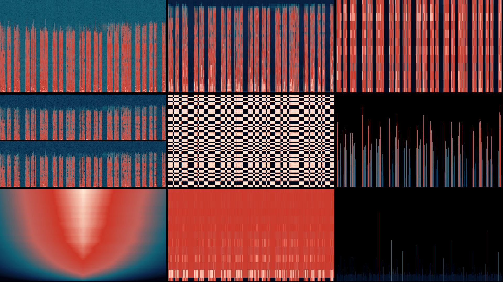

# songsee

**See your sound.** Generate spectrogram visualizations from any audio file.



## Features

- **9 visualization modes**: spectrogram, mel, chroma, hpss, selfsim, loudness, tempogram, mfcc, flux
- **6 color palettes**: classic, magma, inferno, viridis, gray, clawd
- **Combine modes**: Stack multiple visualizations in one image
- **Universal input**: WAV, MP3, or anything ffmpeg can handle
- **Fast**: Native Go, no Python dependencies
- **Flexible output**: PNG or JPEG, customizable dimensions

## Install

```bash
go install github.com/steipete/songsee/cmd/songsee@latest
```

## Quick Start

```bash
# Basic spectrogram
songsee track.mp3

# Mel spectrogram with magma palette
songsee track.mp3 --viz mel --style magma

# All 9 modes combined
songsee track.mp3 --viz spectrogram,mel,chroma,hpss,selfsim,loudness,tempogram,mfcc,flux

# Custom output
songsee track.mp3 --viz hpss,chroma --style inferno -o viz.png --width 2560 --height 1440
```

## Visualization Modes

| Mode | Description |
|------|-------------|
| `spectrogram` | Time × frequency magnitude |
| `mel` | Perceptual frequency scale |
| `chroma` | 12-bin pitch class |
| `hpss` | Harmonic vs percussive separation |
| `selfsim` | Self-similarity matrix |
| `loudness` | Volume over time |
| `tempogram` | Tempo variation |
| `mfcc` | Timbre fingerprint |
| `flux` | Spectral change detection |

## Palettes

`classic` · `magma` · `inferno` · `viridis` · `gray` · `clawd`

## Options

```
--width         Output width (default: 1920)
--height        Output height (default: 1080)
--window        FFT window size (default: 2048)
--hop           Hop size (default: 512)
--start         Start time in seconds
--duration      Duration in seconds
--min-freq      Minimum frequency in Hz
--max-freq      Maximum frequency in Hz
--format        jpg or png (default: jpg)
```

---

Built by [@steipete](https://twitter.com/steipete)
